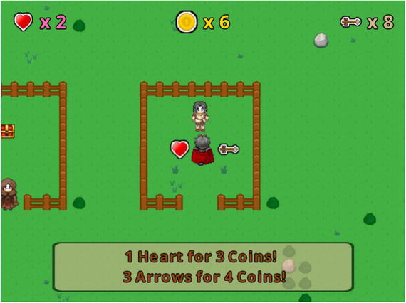

# Game: Treasure Quest

Treasure Quest is an adventure game where the character, called the hero, is called upon to rid the land of flying bat-like creatures (called Flyers) and is promised a treasure chest as a reward.

**Controls**:
- Up, Down, Left and Right keys: moves the hero 
- "S" key: swings the sword
- "A" key: shoots arrow
- "B" key: buy shop items

## Setup

- **Java** 8
- **Gradle** Wrapper 6.7.1
- **LigGDX** 1.9.13: https://github.com/libgdx/libgdx
- **GDX Liftoff** 1.9.13: https://github.com/tommyettinger/gdx-liftoff

## Disclaimer

This "framework" is the result of reading, studying and learning the examples shown in the book "**Java Game Development with LibGDX**" by the author Lee Stemkoski.

- **Book site**: https://www.apress.com/gp/book/9781484233238
- **Source-code**: https://github.com/Apress/java-game-dev-LibGDX
